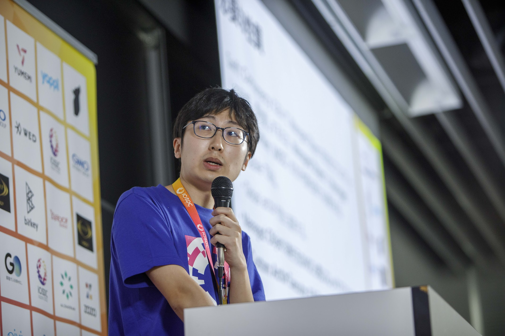

# こんにちは。ひめしです。
[English version is here](profile_en.md)

東京在住のiOSエンジニアです。  

本名: 平井 亨武（ひらい あきむ）

## SNS
- Twitter (X): 
  - [@himeshi_tech](https://twitter.com/himeshi_tech)
  - [@himeshi_hob](https://twitter.com/himeshi_hob) ... Simutrans関連情報発信用のアカウントです。
- GitHub: [teamhimeH](https://github.com/teamhimeh)
- Discord: `himeshi_hob`

## ご依頼について
現在、以下のことがらについてご依頼を承っております。Twitterアカウント[@himeshi_tech](https://twitter.com/himeshi_tech)にまでご連絡ください。  
案件によっては引き受けまで時間を要することがありますので、お早めにご相談をお願いいたします。
- プログラミング家庭教師
  - iOS開発が専門ですが、その他の領域についてもご相談ください。
  - ご依頼の例
    - 大学の研究室での研究のためにiOSアプリを開発する必要があり、そのサポートをしてほしい。
- 技術相談（テックコンサルティング）
  - プロダクトの技術的な課題について、継続的にアドバイスをさせていただきます。
  - プロダクト開発自体は承っておりません。（月あたりの稼働時間に制約があるためです。）

## 技術スタック
- iOSアプリ開発経験（Swift）
  - 業務経験3年、言語自体の経験6年
  - [Apple WWDC18 スカラシップ採用者です。](https://news.mynavi.jp/article/20180531-638677/)
- 個人プロジェクト等で現在常用しているもの
  - プログラミング言語: C++, Python
  - ツール: Git, Docker
- その他経験があるもの
  - プログラミング言語: JavaScript/TypeScript (React, Node), HTML, Java, Kotlin, Ruby, Go, Rust
  - ツール: Docker compose, Terraform
  - クラウドサービス: Firebase, AWS

## 私はこんなエンジニアです。
学生のときから個人開発を行なっており、現職を含め常にユーザと向き合ってきました。ユーザの体験を第一に考えながら開発を進行する意識を常に持っています。

現職における経験を通じて、可読性および保守性を重視した開発ノウハウを獲得しています。ユーザの皆様に信頼して使っていただけるアプリの開発が可能です。

Non-Japaneseの方、他部署および開発組織内の方との円滑なコミュニケーションを取るための高いスキルを保持していると自負しています。小さな組織でも大きな組織でも、協業しチームとして結果に貢献することができます。

また、これまでPRレビューや最新技術のキャッチアップ、シェア等を通じて、チームメンバーのスキル向上に貢献してきました。最新技術については、毎年WWDC期間に特に集中してキャッチアップを行なっています。個人だけではなく、チームとして成長し続けられるようにリードすることが可能です。

## 個人プロジェクト
### Simutrans
[Simutrans](https://www.simutrans.com/)は、フリーでオープンソースの輸送シミュレーションゲームです。このゲームについて、私は以下の活動を行なっています。

- [Simutrans OTRP](https://github.com/teamhimeh/simutrans/wiki/OTRP-Home)の開発、運営
  - 日本のプレイヤー向けに、本家Simutransを大幅に拡張したforkです。2017年から行なっています。
  - 日本のSimutransプレイヤーのうち60%程度がこのfork版を使っていると言われています。
  - 技術領域: C++。SDLという比較的低レイヤなライブラリを用いてグラフィック描画などを行なっています。
- Simutrans Advent Calendarの運営
  - エンジニアの文化であるAdvent CalendarをSimutransコミュニティに持ち込み、毎年運営を行なっています。
  - [2023年版](https://adventar.org/calendars/8680)も大好評満員御礼となりました。
- [Simutrans International Forum](https://forum.simutrans.com/)（本家フォーラム）へのcontribute

### 路線図メーカー
[路線図メーカー](https://wikiwiki.jp/routemapmake/)は、簡単、キレイに路線図を自作できるソフトウェアです。
現在は開発を終了しています。

- 累計20000ダウンロードを記録しています。
- 技術領域: Java, JavaFX（FXMLを用いた開発をしています。）

## 経歴
### 職歴

期間 | 所属 | 備考
---- | ---- | ----
2021年4月 - 2023年9月 | LINE株式会社　|
2023年10月 - 現在 | LINEヤフー株式会社　| 会社合併による

### 学歴

| 期間 | 所属 | 備考 |
| ---- | ---- | ---- |
| 2015年4月 - 2017年3月 | 東京大学教養学部理科一類 ||
| 2017年4月 - 2019年3月 | 東京大学工学部電子情報工学科 | 学士（工学）取得 |
| 2019年4月 - 2021年3月 | 東京大学工学系研究科電気系工学専攻 | 修士（工学）取得 |

### インターン経歴

期間 | 所属 | 内容 | 技術領域
---- | ---- | ---- | ----
2017年7月 | 株式会社VASILY （現 株式会社ZOZO） |　2週間のフルタイムインターンとして、自然言語処理を用いてECサイト内での商品検索結果改善を担当。 | Ruby on Rails、Solr、MeCab
2018年3月 | 株式会社オクト （現 株式会社アンドパット） |　1ヶ月のフルタイムインターンとして、SAASサービスのCI/CD環境の改善を担当。 | AWS, Terraform, Docker

### 執筆登壇経験

時期 | カテゴリ | 資格 
---- | ---- | ----
2022年10月 | 技術ブログ | LINE Engineering Blog記事 [Swiftにおけるprogress handlerを伴う非同期API関数の定義方法](https://engineering.linecorp.com/ja/blog/swift-asynchronous-function-api-with-a-progress-handler)
2023年9月 | 登壇 | iOSDC Japan 2023 [ActorでCoreDataをスレッドから解放しよう](https://fortee.jp/iosdc-japan-2023/proposal/240c16ac-498a-4d17-a43a-f34f0fdbe041)
2023年9月 | ポスター発表 | iOSDC Japan 2023 [大規模アプリにおいてデバイス上のユーザデータを安全に暗号化する](https://fortee.jp/iosdc-japan-2023/proposal/2efea065-73fe-4c1c-a4ca-2bcaad26ab3e)

### 保有資格

取得日 | 資格 
---- | ----
2019年4月 | TOEIC L&R 900点
2022年4月 | 個人情報保護士試験合格
2022年7月 | IPA情報セキュリティマネジメント試験合格
2022年12月 | IPA令和4年度秋期情報処理安全確保支援士試験合格