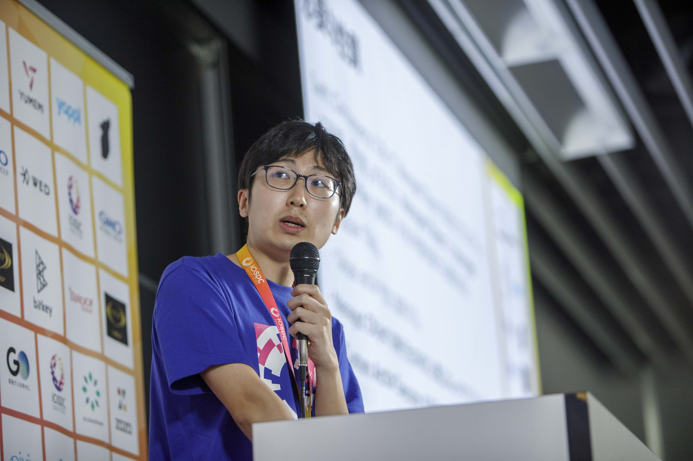

# Hi. I'm Himeshi.
[日本語版はこちら](index.md)

I'm an iOS engineer at Tokyo.

My real name: Hirai Akimu

## SNS
- Twitter (X): 
  - [@himeshi_tech](https://twitter.com/himeshi_tech)
  - [@himeshi_hob](https://twitter.com/himeshi_hob) ... This account is for Simutrans.
- GitHub: [teamhimeH](https://github.com/teamhimeh)
- Discord: `himeshi_hob`

## Personal Services
Currently, I provide the following services as an individual. Please contact me at my Twitter account [@himeshi_tech](https://twitter.com/himeshi_tech).

Please note that it may take some time to accept, depending on the situation.

- Programming tutor
  - iOS development is my specialty, but please feel free to consult me about other areas as well.
  - Examples of requests
    - I need to develop an iOS app for my research at the university lab, and I want your support.
- Technical consultation
  - I will provide continuous advice on the technical challenges of the product.
  - I am not providing product development itself. (Because my working hour is limited.)

## Tech stacks
- iOS app development experience (Swift)
  - 3 years of work experience, 6 years of experience with the language itself
  - [I am an Apple WWDC18 scholarship winner.](https://news.mynavi.jp/article/20180531-638677/)
- For my personal projects, I currently use the following regularly.
  - Programming languages: C++, Python
  - Tools: Git, Docker
- I have experience with
  - Programming languages: JavaScript/TypeScript (React, Node), HTML, Java, Kotlin, Ruby, Go, Rust
  - Tools: Docker compose, Terraform
  - Cloud services: Firebase, AWS

## My PR as an engineer
Since I was a student, I have been working for my personal projects. I always communicate with users, in both my current job and my personal projects. The user experience is the most important thing in my development.

Through my experience at my current job, I have acquired the know-how of development that emphasizes readability and maintainability. I can develop apps that users can trust and use.

I am confident with communicating smoothly with non-Japanese people, other departments, and within the development organization. I can collaborate and contribute to the results as a team, whether in a small or large organization.

Also, I have contributed to the skill improvement of team members through pull request reviews, catching up and sharing the latest technologies, and so on. I can lead the growth of not only myself, but also the team.

## Personal projects
### Simutrans
[Simutrans](https://www.simutrans.com/) is a free and open source transport simulation game. For this game, I do the following activities.

- Development of [Simutrans OTRP](https://github.com/teamhimeh/simutrans/wiki/OTRP-Home)
  - This is a fork for Japanese players that extends the original Simutrans. I have been working on this since 2017.
  - About 60% of Japanese Simutrans players use this fork version.
  - Tech stacks: C++, SDL - a low-level graphic library.
- Hosting "Simutrans Advent Calendar" event
  - I brought the culture of Advent Calendar, which is an engineer's culture, to the Simutrans community and have been hosting it every year.
  - In [2023 edition](https://adventar.org/calendars/8680), all slots were filled and it was a success.
- Contribute to [Simutrans International Forum](https://forum.simutrans.com/) (upstream)

### Route map maker
[Route map maker](https://wikiwiki.jp/routemapmake/) is a software that enables you to create your own beautiful route maps easily.
It is already discontinued.

- It has recorded a total of 20,000 downloads.
- Technical area: Java, JavaFX (FXML)

## Career

Only part of my carrer is listed here. For the full list, please refer the Japanese page.

### Work history

Period | Affiliation | Remarks
---- | ---- | ----
April 2021 - September 2023 | LINE Corporation |
October 2023 - present | LY Corporation | Due to company merger

### Educational background

| Period | Affiliation | Remarks |
| ---- | ---- | ---- |
| April 2015 - March 2017 | The university of Tokyo, Faculty of Liberal Arts Science I ||
| April 2017 - March 2019 | The university of Tokyo, Faculty of Engineering, Department of Electrical and Information Engineering | Bachelor of Engineering |
| April 2019 - March 2021 | The university of Tokyo, Graduate School of Engineering, Electrical Engineering Department | Master of Engineering |

### Writing and speaking experience

Time | Category | Qualification 
---- | ---- | ----
October 2022 | Technical blog | LINE Engineering Blog article (Japanese) [How to define asynchronous API functions with progress handler in Swift](https://engineering.linecorp.com/ja/blog/swift-asynchronous-function-api-with-a-progress-handler)
September 2023 | Tech talk | iOSDC Japan 2023 [Let's free CoreData from threads with Actor](https://fortee.jp/iosdc-japan-2023/proposal/240c16ac-498a-4d17-a43a-f34f0fdbe041)
September 2023 | Poster presentation | iOSDC Japan 2023 [Securely encrypt user data on devices in large-scale apps](https://fortee.jp/iosdc-japan-2023/proposal/2efea065-73fe-4c1c-a4ca-2bcaad26ab3e)
